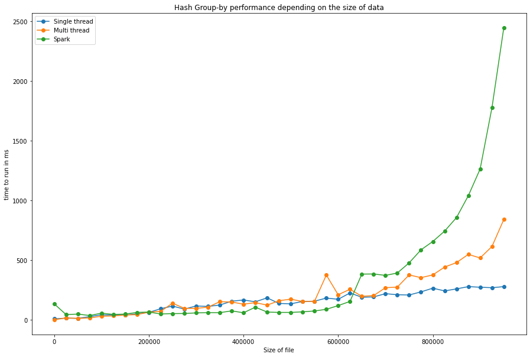
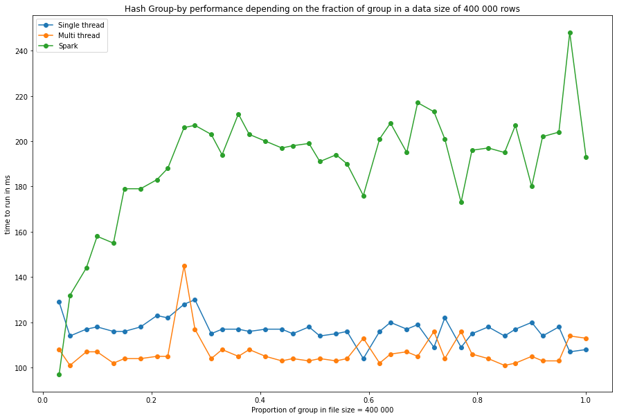

# Group By Hash
This folder contains implementations of "hash" GROUP BY. 

## Architecture
The main code used to generate the results files is [MainTest.java](final/src/main/java/MainTest.java).
We have done 3 implemtentations :
 - Single-Threaded Hash Group By, that can be found [there](final/src/main/java/raw_java/HashGroupBySingle.java).
 - Multi-Threaded Hash Group By, that can be found  [there](final/src/main/java/raw_java/PartitioningHashGroupBy.java).
 - Spark distributed Hash Group By, that can be found [there](final/src/main/java/spark/HashGroupBySpark.java).
 
 The Spark module and the raw Java module are separated :
  - [Raw Java module](final/src/main/java/raw_java)
  - [Spark module](final/src/main/java/spark)
  
The architecture inside the modules are quite similar but are differ in several points, especially the Spark implementation required some adaptations in order to work with the Spark framework.

## Implementation details
### Single Threaded
It is important to understand the concepts involved in the single-threaded version, because both multi-processors and spark implementation borrow from it. The algorithm works in two passes. One is to fill a hashtable with the aggregated groups values. The other one simply outputs the groups. From this, one can see that the most interesting part is the hashtable, and how to insert, retrieve and update values. See the report to get more details about the hashtable implementation.

### Multithreaded Implementation
*We implemented three versions of the multiprocessor algorithm. We only kept the best performing option for the measures.*

Our implementation of the partitioning hash table starts by creating a new hash-table for each thread. There is no need for a merge function. Instead, each thread will only input in its own hashtable the records that belong to its partition. The partition is determined by a modular hashing on the group, by the number of threads. This way, no two records belonging to the same groups can be managed by different threads. 
Because of this careful partitioning, there is no need to merge outputs. Each thread can start outputting groups as soon as it is finished.

### Spark Implementation
The Spark implementation uses only function of the main Spark module and not the SparkSQL module.
In fact, apart from the functions used to parse the input files we only used two functions :
- **mapPartitions** which splits the input for the different workers and perform an operation on each partition. 
- **reduce** that take the results of **mapPartitions** and group 2 by 2 the output until we obtain a final result.

All of the others operations are handmade and are based on what was implemented for the singlethreaded and multithreaded algorithms, though it has some small differences that are not supposed to influence performance (e.g. we hash on String rather than Integer).

## Results

Test were runned on two folders of files, with variables **group** distribution and **size**.
The folders can be found there:
 - [Size test](/dataGen/size)
 - [Group test](/dataGen/group)
 
 The results can be found there:
 - [Size results](final/result_size.csv)
 - [Group results](final/result_group.csv)
 
 Results format are : **file**;**timeSingleThreaded**;**timeMultiThreaded**;**timeSpark**
 
 ### Plots
Below you can find the results of the tests for the two folders (**size** and **group**).
 
 

### Analysis
For the **size test**, 
 - What we can see is that the Spark implementation outclasses the two others when the amount of data is small, then is way worse when the data is huge. Considering these tests have been run on a computer with 4 cores, using 4 threads in parallel we can assume that it would have been faster on more cores, as Spark is a language made to scale. The growth rate in n, the number of data, seem to be polynomial.
 - The multi-threaded implementation behaves like the Spark one, but an order of magnitude faster. It also seems to be polynomial in n, probably due to some constraints related to the computer rather than the algorithm in itself. The gain for the multithreaded implementation is quite brittle: we recovered only an 1.5 speedup for a 4 cores run. This might be explained by how fast the single-threaded version already is: every little additional instruction to enable concurrency is in fact a lot of overhead. The sort-group implementation scaled way better with the number of threads.
 - The single-threaded implementation seems to be the most efficient one. It keeps its theoretical linear dependency in n and so achieves the best performances. It is coherent, considering the fact that we supposed all of the inputs fitted in memory. Scaling seems to be linear until an exponential explosion for the largest inputs. Explanation is that performance is severely hit when running close to maximum memory. 

For the **group test**, 
 - The Spark implementation is almost always worse than the others. Considering the implementations are very similar, it is, we suppose, due to the Spark process in itself, and the fact that our class CustomHashTable is not optimized to work with it.
 - The two other implementations seem to be quite independent from the number of groups, and quite similar in their performances. This is different from the nested loop results, where time spent is linear on the number of groups.

